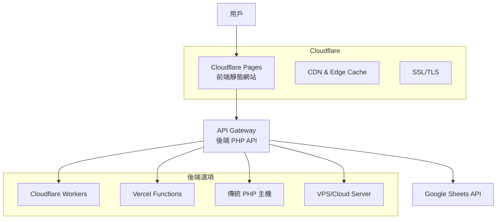

# 🚀 Sheet Order Dashboard - GitHub + Cloudflare 部署方案

本文件提供將蘿蔔糕訂購系統部署到 GitHub + Cloudflare 的完整指南。

## 📋 目錄

1. [部署架構概覽](#部署架構概覽)
2. [前置準備](#前置準備)
3. [前端部署 (Cloudflare Pages)](#前端部署-cloudflare-pages)
4. [後端 API 部署選項](#後端-api-部署選項)
5. [環境配置](#環境配置)
6. [部署步驟](#部署步驟)
7. [監控與維護](#監控與維護)
8. [疑難排解](#疑難排解)

---

## 🏗️ 部署架構概覽

### 分離式部署架構



### 技術棧分離

- **前端**: React + TypeScript + Vite → Cloudflare Pages
- **後端**: PHP API → 獨立 PHP 託管服務
- **資料**: Google Sheets API (保持不變)
- **CDN**: Cloudflare (自動)

---

## 🔧 前置準備

### 1. 帳號準備

#### GitHub 帳號
- 建立 GitHub 帳號 (免費)
- 建立新的 Repository

#### Cloudflare 帳號
- 建立 Cloudflare 帳號 (免費)
- 取得 API Token (需要 `Cloudflare Pages:Edit` 權限)
- 記錄 Account ID

#### 後端託管服務 (選擇其一)
- **選項 A**: Cloudflare Workers (推薦，免費額度充足)
- **選項 B**: Vercel (免費，支援 PHP 透過 API Routes)
- **選項 C**: 傳統 PHP 主機 (如 Hostinger, SiteGround)
- **選項 D**: VPS/Cloud Server (如 DigitalOcean, Linode)

### 2. 必要檔案準備

#### 敏感檔案處理
⚠️ **重要**: 以下檔案絕對不能提交到 GitHub：

```bash
# 已在 .gitignore 中排除
service-account-key*.json  # Google Service Account 金鑰
.env                      # 環境變數檔案
cache/                    # 快取目錄
```

---

## 🌐 前端部署 (Cloudflare Pages)

### 1. GitHub Repository 設定

#### 建立新 Repository
```bash
# 在 GitHub 建立新的 Repository
# 名稱建議: sheet-order-dashboard

# 本地初始化 (如果尚未初始化)
git init
git add .
git commit -m "Initial commit: Sheet Order Dashboard"
git branch -M main
git remote add origin https://github.com/你的用戶名/sheet-order-dashboard.git
git push -u origin main
```

#### 設定 GitHub Secrets
在 GitHub Repository → Settings → Secrets and variables → Actions 中設定：

**Secrets (敏感資訊)**:
```bash
CLOUDFLARE_API_TOKEN=你的_Cloudflare_API_Token
CLOUDFLARE_ACCOUNT_ID=你的_Cloudflare_Account_ID
VITE_API_HOST=https://你的後端API域名.com
```

**Variables (非敏感配置)**:
```bash
CLOUDFLARE_PROJECT_NAME=sheet-order-dashboard
VITE_APP_ENV=production
VITE_API_BASE_URL=/api
VITE_GOOGLE_SHEET_ID=10MMALrfBonchPGjb-ps6Knw7MV6lllrrKRCTeafCIuo
VITE_APP_TITLE=融氏古早味蘿蔔糕 - 訂單管理後台
VITE_APP_DESCRIPTION=蘿蔔糕訂購系統管理後台
VITE_CACHE_DURATION=15000
VITE_DEBUG_MODE=false
```

### 2. Cloudflare Pages 設定

#### 方式 A: 透過 GitHub Actions (推薦)
已設定 GitHub Actions 工作流程 (`.github/workflows/deploy.yml`)，推送到 `main` 分支時自動部署。

#### 方式 B: 直接連接 GitHub
1. 登入 Cloudflare Dashboard
2. 進入 Pages → Create a project
3. 選擇 Connect to Git → 選擇你的 Repository
4. 設定建置參數：
   ```
   Framework preset: Vite
   Build command: npm run build
   Build output directory: dist
   Root directory: /
   ```
5. 設定環境變數 (同上述 Variables)

---

## 🔧 後端 API 部署選項

### 選項 A: Cloudflare Workers (推薦)

#### 優點
- 免費額度充足 (每日 100,000 請求)
- 全球邊緣運算，速度快
- 無需伺服器管理
- 支援 PHP 透過 WASM

#### 部署步驟
```bash
# 安裝 Wrangler CLI
npm install -g wrangler

# 登入 Cloudflare
wrangler login

# 建立 Worker 專案
wrangler init sheet-order-api

# 部署配置
wrangler.toml:
```
```toml
name = "sheet-order-api"
main = "src/index.js"
compatibility_date = "2024-01-01"

[env.production.vars]
GOOGLE_SHEET_ID = "10MMALrfBonchPGjb-ps6Knw7MV6lllrrKRCTeafCIuo"

[env.production.secrets]
GOOGLE_SERVICE_ACCOUNT_KEY = "從 service-account-key2.json 複製的內容"
```

#### 注意事項
- 需要將 PHP 代碼轉換為 JavaScript/TypeScript
- Google Sheets API 調用需要適配

### 選項 B: Vercel Functions

#### 優點
- 免費額度適中
- 支援多種語言
- 易於部署

#### 部署步驟
```bash
# 安裝 Vercel CLI
npm install -g vercel

# 部署
vercel

# 環境變數設定
vercel env add GOOGLE_SERVICE_ACCOUNT_KEY
vercel env add GOOGLE_SHEET_ID
```

### 選項 C: 傳統 PHP 主機

#### 推薦服務商
- **Hostinger**: 便宜，支援 PHP 8+
- **SiteGround**: 效能佳，支援 Git 部署
- **Bluehost**: 穩定，適合小型專案

#### 部署步驟
1. 購買 PHP 主機服務
2. 設定自定義域名
3. 上傳 `api/` 目錄到主機
4. 上傳 `service-account-key2.json` (設定權限 600)
5. 設定 CORS headers

### 選項 D: VPS/Cloud Server

#### 推薦服務
- **DigitalOcean Droplet**: $5/月起
- **Linode**: 效能穩定
- **Vultr**: 價格便宜

#### 環境設定
```bash
# Ubuntu 22.04 LTS
sudo apt update
sudo apt install nginx php8.1-fpm php8.1-curl php8.1-json php8.1-mbstring

# 設定 Nginx
sudo nano /etc/nginx/sites-available/sheet-order-api

# SSL 憑證 (Let's Encrypt)
sudo certbot --nginx -d api.yourdomain.com
```

---

## ⚙️ 環境配置

### 1. 本地開發環境

建立 `.env` 檔案：
```bash
# 複製範例檔案
cp .env.example .env

# 編輯配置
nano .env
```

```env
# 開發環境配置
VITE_APP_ENV=development
VITE_API_BASE_URL=/sheet-order-dashboard-main/api
VITE_API_HOST=
VITE_GOOGLE_SHEET_ID=10MMALrfBonchPGjb-ps6Knw7MV6lllrrKRCTeafCIuo
VITE_APP_TITLE=融氏古早味蘿蔔糕 - 訂單管理後台 (開發)
VITE_APP_DESCRIPTION=蘿蔔糕訂購系統管理後台 - 開發環境
VITE_CACHE_DURATION=5000
VITE_DEBUG_MODE=true
```

### 2. 生產環境配置

在 GitHub Secrets/Variables 或主機控制台設定：

```env
# 生產環境配置
VITE_APP_ENV=production
VITE_API_BASE_URL=/api
VITE_API_HOST=https://api.yourdomain.com
VITE_GOOGLE_SHEET_ID=10MMALrfBonchPGjb-ps6Knw7MV6lllrrKRCTeafCIuo
VITE_APP_TITLE=融氏古早味蘿蔔糕 - 訂單管理後台
VITE_APP_DESCRIPTION=蘿蔔糕訂購系統管理後台
VITE_CACHE_DURATION=15000
VITE_DEBUG_MODE=false
```

---

## 🚀 部署步驟

### Phase 1: 準備階段

#### 1. 程式碼準備
```bash
# 1. 確保所有變更已提交
git add .
git commit -m "feat: 新增生產環境配置和部署工作流程"

# 2. 推送到 GitHub
git push origin main

# 3. 確認 .gitignore 正確排除敏感檔案
cat .gitignore | grep -E "(service-account|\.env)"
```

#### 2. 後端 API 部署
根據選擇的後端方案，完成 API 部署：

**檢查清單**:
- ✅ PHP API 檔案已上傳
- ✅ Google Service Account 金鑰已設定
- ✅ CORS headers 已配置
- ✅ SSL 憑證已安裝 (HTTPS)
- ✅ 測試端點可正常存取

#### 3. API 端點測試
```bash
# 測試 API 連接
curl https://your-api-domain.com/api/check_api_path.php

# 測試訂單取得
curl https://your-api-domain.com/api/get_orders_from_sheet.php?refresh=1
```

### Phase 2: 前端部署

#### 1. GitHub Actions 部署 (自動)
推送到 `main` 分支會自動觸發部署：

```bash
git push origin main
```

在 GitHub → Actions 頁面查看部署狀態。

#### 2. 手動部署 (備用)
```bash
# 本地建置測試
npm run build

# 預覽建置結果
npm run preview

# 檢查建置檔案
ls -la dist/
```

### Phase 3: 驗證與測試

#### 1. 功能測試清單
- ✅ 網站可正常載入
- ✅ API 連接正常
- ✅ 訂單列表顯示
- ✅ 篩選功能運作
- ✅ 批量操作正常
- ✅ CSV 匯出功能
- ✅ 響應式設計適配

#### 2. 效能測試
```bash
# 使用 Lighthouse 測試
npm install -g lighthouse
lighthouse https://your-site.pages.dev --view

# 檢查 API 回應時間
curl -w "@curl-format.txt" -o /dev/null -s https://your-api-domain.com/api/get_orders_from_sheet.php
```

---

## 📊 監控與維護

### 1. Cloudflare Analytics

#### 設定監控
- 啟用 Web Analytics (免費)
- 設定 Custom Events 追蹤重要操作
- 監控 Core Web Vitals

#### 重要指標
- 頁面載入時間
- API 回應時間
- 錯誤率
- 使用者地理分布

### 2. 錯誤監控

#### 前端錯誤追蹤
在 `index.html` 中已設定基本錯誤處理，可加強：

```javascript
// 進階錯誤追蹤 (可選)
window.addEventListener('error', function(event) {
  // 發送錯誤到監控服務
  fetch('/api/log_error.php', {
    method: 'POST',
    body: JSON.stringify({
      message: event.error.message,
      stack: event.error.stack,
      url: window.location.href,
      timestamp: Date.now()
    })
  });
});
```

#### 後端監控
```php
// API 錯誤日誌 (在各 PHP 檔案中)
error_log(json_encode([
    'timestamp' => date('Y-m-d H:i:s'),
    'endpoint' => $_SERVER['REQUEST_URI'],
    'error' => $errorMessage,
    'ip' => $_SERVER['REMOTE_ADDR']
]));
```

### 3. 自動化維護

#### GitHub Actions 工作流程
已設定自動部署，可新增：

```yaml
# .github/workflows/maintenance.yml
name: Maintenance Tasks

on:
  schedule:
    - cron: '0 2 * * 0'  # 每週日 2AM

jobs:
  cleanup:
    runs-on: ubuntu-latest
    steps:
      - name: Clear API Cache
        run: |
          curl -X POST https://your-api-domain.com/api/clear_cache.php
      
      - name: Health Check
        run: |
          curl -f https://your-site.pages.dev/api/health
```

### 4. 備份策略

#### 程式碼備份
- GitHub Repository (自動)
- 定期 Export Repository

#### 資料備份
- Google Sheets 自動版本控制
- 定期匯出 Excel 備份

#### 設定備份
```bash
# 建立設定備份腳本
#!/bin/bash
# backup-config.sh

DATE=$(date +%Y%m%d)
mkdir -p backups/$DATE

# 備份環境變數 (移除敏感資訊)
env | grep VITE_ > backups/$DATE/env-vars.txt

# 備份 Cloudflare 設定
wrangler kv:namespace list > backups/$DATE/kv-namespaces.json
```

---

## 🔧 疑難排解

### 常見問題與解決方案

#### 1. API 連接問題

**問題**: `Failed to fetch` 或 CORS 錯誤

**解決步驟**:
```bash
# 1. 檢查 API 端點是否可存取
curl -I https://your-api-domain.com/api/check_api_path.php

# 2. 檢查 CORS headers
curl -H "Origin: https://your-site.pages.dev" \
     -H "Access-Control-Request-Method: GET" \
     -H "Access-Control-Request-Headers: X-Requested-With" \
     -X OPTIONS \
     https://your-api-domain.com/api/get_orders_from_sheet.php

# 3. 檢查環境變數
echo $VITE_API_HOST
```

**修復方案**:
```php
// api/common_headers.php
header("Access-Control-Allow-Origin: https://your-site.pages.dev");
header("Access-Control-Allow-Methods: GET, POST, OPTIONS");
header("Access-Control-Allow-Headers: Content-Type, X-Requested-With");
header("Access-Control-Max-Age: 86400");
```

#### 2. 建置失敗

**問題**: GitHub Actions 建置失敗

**檢查步驟**:
```bash
# 1. 本地測試建置
npm ci
npm run lint
npm run build

# 2. 檢查環境變數
cat .env.example
```

**常見原因**:
- 缺少必要的環境變數
- TypeScript 類型錯誤
- 依賴套件版本衝突

#### 3. Google Sheets API 錯誤

**問題**: 403 Forbidden 或 401 Unauthorized

**檢查步驟**:
1. Service Account 金鑰是否正確設定
2. Google Sheets 是否已分享給 Service Account email
3. Google Sheets API 是否已啟用

**修復方案**:
```bash
# 重新設定 Service Account
1. 到 Google Cloud Console
2. 建立新的 Service Account
3. 下載新的金鑰檔案
4. 更新環境變數/Secrets
```

#### 4. 快取問題

**問題**: 資料不更新或顯示舊資料

**清除步驟**:
```bash
# 1. 前端快取
location.reload(true)

# 2. API 快取
curl https://your-api-domain.com/api/get_orders_from_sheet.php?refresh=1

# 3. Cloudflare 快取
# 在 Cloudflare Dashboard → Caching → Purge Cache
```

#### 5. 效能問題

**問題**: 載入速度慢

**優化步驟**:
```bash
# 1. 檢查建置大小
npm run build
du -sh dist/

# 2. 分析 bundle
npx vite-bundle-analyzer dist/

# 3. 啟用 Cloudflare 優化
- Auto Minify (JS, CSS, HTML)
- Brotli Compression
- Rocket Loader
```

---

## 📝 部署檢查清單

### 部署前檢查
- [ ] 所有敏感檔案已加入 `.gitignore`
- [ ] 環境變數已正確設定
- [ ] API 端點測試通過
- [ ] 本地建置成功
- [ ] 程式碼已推送到 GitHub

### 部署後檢查
- [ ] 網站可正常存取
- [ ] API 連接正常
- [ ] 所有功能運作正常
- [ ] SSL 憑證有效
- [ ] 效能指標符合預期
- [ ] 錯誤監控已設定

### 維護清單
- [ ] 定期檢查依賴更新
- [ ] 監控 API 使用量
- [ ] 備份重要資料
- [ ] 檢查安全性警告
- [ ] 更新文檔

---

## 🎯 最佳實務建議

### 1. 安全性
- 使用 HTTPS (SSL/TLS)
- 定期更新依賴套件
- 限制 API 存取權限
- 監控異常活動

### 2. 效能優化
- 啟用 CDN 快取
- 壓縮靜態資源
- 使用適當的快取策略
- 監控 Core Web Vitals

### 3. 可靠性
- 設定健康檢查
- 實施錯誤處理
- 建立監控警報
- 規劃災難恢復

### 4. 開發流程
- 使用 Git Flow
- 程式碼審查
- 自動化測試
- 持續部署

---

## 📞 支援與資源

### 文檔資源
- [Cloudflare Pages 文檔](https://developers.cloudflare.com/pages/)
- [GitHub Actions 文檔](https://docs.github.com/en/actions)
- [Vite 部署指南](https://vitejs.dev/guide/static-deploy.html)

### 社群支援
- [Cloudflare Community](https://community.cloudflare.com/)
- [GitHub Community](https://github.community/)
- [Stack Overflow](https://stackoverflow.com/questions/tagged/cloudflare-pages)

### 緊急聯絡
如遇到部署問題，可檢查：
1. GitHub Actions 執行日誌
2. Cloudflare Pages 建置日誌  
3. 瀏覽器開發者工具錯誤訊息
4. API 伺服器錯誤日誌

---

**文件版本**: v1.0  
**最後更新**: 2025-01-28  
**作者**: Claude AI Assistant  

> 💡 **提示**: 這是一個完整的部署指南，請根據實際需求選擇適合的後端方案。建議先在測試環境進行部署驗證，確認無誤後再部署到生產環境。