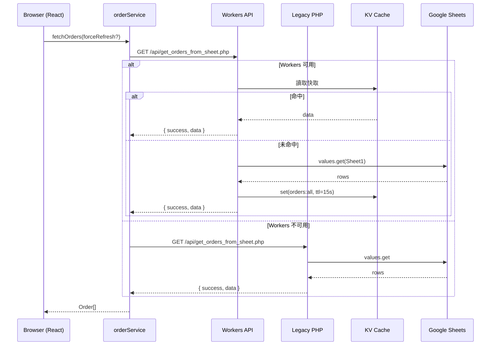
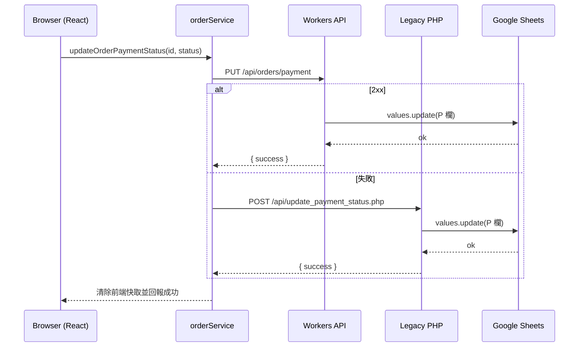
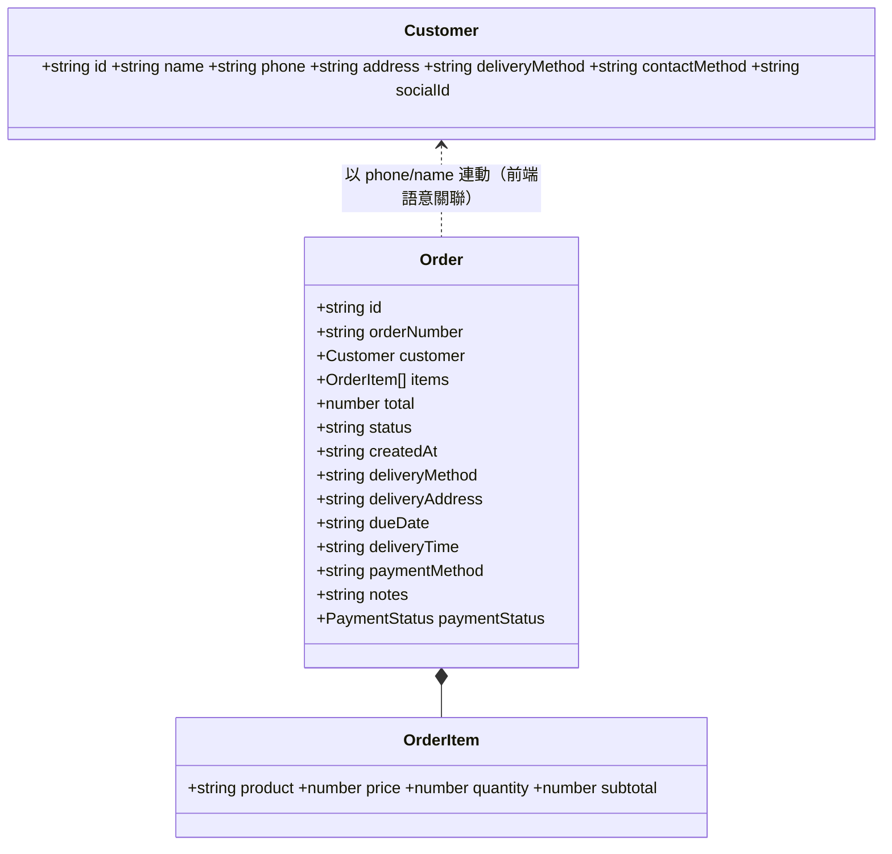

## 專案規格（依程式碼實際行為產生）

本文件以程式碼為唯一依據（Workers/Legacy PHP/前端/Supabase Edge Functions），不參考舊有說明內容。涵蓋：
- 架構與運行環境
- 資料模型（Google Sheets 映射）
- API 端點（Workers 與 Legacy PHP 對照）
- 快取策略（前端/Workers KV/PHP 檔案）
- 認證與資料遷移流程
- UML 圖（流程/循序/資料關聯）
- 風險與後續建議

---

## 架構總覽

- 前端（React + Vite + shadcn/ui）
  - 主要互動頁：`src/pages/Index.tsx`
  - 資料服務：`src/services/orderService.ts`、`src/services/customerService.ts`
  - 環境自動判斷與降級：Workers → 本地 Workers → Legacy PHP
  - 前端記憶體快取：訂單/客戶（預設 15 秒）

- API 層 1（Cloudflare Workers, Hono）
  - 路由入口：`sheet-order-api/src/index.ts`
  - Google Sheets 存取：`services/GoogleSheetsService.ts`（Service Account → JWT → OAuth2）
  - KV 快取：`services/CacheService.ts`（帶 `timestamp/ttl` 的包裝與 `expirationTtl` 後援）
  - 與舊 PHP 相容路由：維持 `/api/*.php` 風格路徑，便於前端無痛切換

- API 層 2（Legacy PHP）
  - 目錄：`/api/*.php`（使用 Google PHP SDK）
  - 伺服器檔案快取：`/cache/*.json`（15 秒）
  - 作為 Workers 無法連線時的後備

- 後端服務（Supabase Edge Functions）
  - 登入：`supabase/functions/admin-login/` 與 `admin-auth/`
  - 遷移：`supabase/functions/migrate-sheets-data/`（由 Google Sheets 導入 Supabase 資料庫）

- 部署/設定
  - Workers：`sheet-order-api/wrangler.jsonc`（KV 綁定、環境變數、CORS）
  - Supabase：`supabase/config.toml`

```mermaid
flowchart LR
  A[Browser (React)] -- API --> B{選擇器\norderService}
  B -- 優先 --> C[Cloudflare Workers\n(Hono API)]
  B -- 降級 --> D[Legacy PHP API]
  C <---> E[KV 快取]
  C --> F[Google Sheets]
  D --> F
  A -- Admin/Migrate --> G[Supabase Edge Functions]
  G <--> H[Supabase DB]
```

---

## 執行環境與變數（重要）

- Workers（`wrangler.jsonc`）
  - `CACHE_KV`：Cloudflare KV 綁定
  - `GOOGLE_SHEET_ID`：目標試算表 ID
  - `CACHE_DURATION`：設計上以秒為單位（程式以 `parseInt` 解析）。目前檔案中存在 `"15000"`/`"5000"`，等同 15000s/5000s，請修正為 `"15"` 以符合預期
  - `GOOGLE_SERVICE_ACCOUNT_KEY`：請以 secrets 設定（JSON 字串）
  - CORS 允許來源：`src/index.ts` 明確列出 Pages 與本地端口

- Supabase Edge Functions（`supabase/config.toml`）
  - `SUPABASE_URL`、`SUPABASE_SERVICE_ROLE_KEY`
  - `JWT_SECRET`（自簽 JWT 用）
  - `GOOGLE_SERVICE_ACCOUNT_KEY`（遷移用）

- Legacy PHP
  - Google 認證檔：`service-account-key2.json`
  - 伺服器檔案快取目錄：`/cache/`

---

## 資料模型與 Google Sheets 映射

來源工作表：
- 訂單：`Sheet1`
- 客戶名單：`客戶名單`

訂單（Workers 端 `types.ts` → 前端 `types/order.ts` 轉換）：
- createdAt（A 欄）
- id：行索引（前端以字串使用）
- orderNumber：`ORD-xxx`
- customerName（B 欄）/ customerPhone（C 欄） → 前端組成 `customer: { name, phone }`
- items（I 欄，字串；前端解析為陣列）
- amount（J 欄） → 前端 `total`
- dueDate（F 欄，嘗試轉為 `YYYY-MM-DD`）
- deliveryTime（G 欄）
- note（H 欄） → 前端 `notes`
- status（O 欄：`訂單確認中` | `已抄單` | `已出貨` | `取消訂單`）
- deliveryMethod（D 欄）
- deliveryAddress（E 欄）
- paymentMethod（M 欄）
- paymentStatus（P 欄：''/`未收費`/`已收費`/`待轉帳`/`未全款`/`特殊`）

客戶（依表頭動態映射）
- 基本欄：姓名、電話、地址、取貨方式、訂單時間、購買項目…（程式動態檢出）
- id：行索引（資料列順序）

Supabase（在 `SupabaseService.ts` 中之型別）
- `orders`（`order_number`, `customer_name`, `customer_phone`, `status`, `payment_status`, `total_amount`, `delivery_method`, ...）
- `customers`（`name`, `phone`, `address`, `region`, ...）

---

## API 規格（Workers 端點）

所有回應皆遵循：`{ success: boolean, data?, message?, timestamp?, request_id? }`，並在 Header 帶有 `X-Request-ID`、`X-Response-Time`、`X-Cache`（命中時）。

- GET `/api/orders`
  - Query：`refresh=1`（強制刷新）、`_`（時間戳）
  - 行為：優先讀 KV；未命中則讀 Sheets 並回寫 KV（預設 15 秒）
  - 回傳：`data: Order[]`

- GET `/api/customers`
  - Query：`refresh=1`、`nonce`
  - 行為：類似 `/api/orders`，但從 `客戶名單` 讀表頭動態映射

- PUT `/api/orders/status`
  - Body：`{ id: string, status: '訂單確認中'|'已抄單'|'已出貨'|'取消訂單' }`
  - 行為：嘗試以表頭尋找 `id/status` 欄寫入；成功後刪除 `orders:all` 快取
  - 風險：若 Sheet 頭列未含 `id`/`status` 英文欄名會失敗（見「風險與建議」）

- PUT `/api/orders/payment`
  - Body：`{ id: string, status: ''|'未收費'|'已收費'|'待轉帳'|'未全款'|'特殊' }`
  - 行為：直接寫入 `P 欄（款項狀態）`；成功後清除 `orders:all`

- PUT `/api/orders/items`
  - Body：`{ id: string, items: {product,quantity,price,subtotal}[], total: number }`
  - 行為：批次更新 `I 欄（購買項目）` 與 `J 欄（金額）`；成功後清除 `orders:all`

- DELETE `/api/orders`
  - Body：`{ id: string }`
  - 行為：以 `sheetId + deleteDimension` 刪該行；之後對 `N 欄（假設為 id 欄）` 自刪除列起進行連續性重編；清除 `orders:all`

- DELETE `/api/orders/batch`
  - Body：`{ ids: string[] }`
  - 行為：按行號由大到小刪除以避免位移；完畢後重編 `N 欄 id`；清除 `orders:all`
  - 回傳：每筆結果、`totalDeleted/totalFailed`、重編摘要

- GET `/api/customers/orders`
  - Query：`phone`（必要）、`nonce`、`refresh=1`
  - 行為：`客戶名單` 以電話「後九碼」比對，回傳 `{ id, orderTime, items, name }[]`；可快取於 KV（key：`customer_orders:{phone}`）

- POST `/api/admin/login`
  - Body：`{ username, password }`
  - 行為：簡化硬編碼/環境變數驗證，生成隨機 token（非 JWT）
  - 建議：正式環境請改用 Supabase Edge Functions 的 JWT 登入端點

- GET `/api/admin/dashboard`
  - 行為：讀取 Sheet 計算統計（今日/本週/狀態/付款）；再讀 `客戶名單` 估算總客戶
  - 快取：以 `cacheService.set(..., 300)` 建議 5 分鐘
  - 注意：此端點在程式中使用工作表名稱 `'訂單'`，與其餘端點 `'Sheet1'` 不同，請確認實際試算表頁籤名稱

與 Legacy PHP 兼容的相同路由（Workers 內部代理）：
- GET `/api/get_orders_from_sheet.php` → 同 `/api/orders`
- GET `/api/get_customers_from_sheet.php` → 同 `/api/customers`
- POST `/api/update_order_status.php` → 同 `/api/orders/status`
- POST `/api/update_payment_status.php` → 同 `/api/orders/payment`
- POST `/api/update_order_items.php` → 同 `/api/orders/items`
- POST `/api/delete_order.php` → 同 `/api/orders`
- POST `/api/batch_delete_orders.php` → 同 `/api/orders/batch`
- POST `/api/admin_login.php` → 同 `/api/admin/login`
- GET `/api/get_customer_orders.php` → 同 `/api/customers/orders`

### Legacy PHP API（重點行為）

- GET `/api/get_orders_from_sheet.php`：檔案快取 15 秒；欄位映射與 Workers 一致
- GET `/api/get_customers_from_sheet.php`：檔案快取 15 秒；表頭動態映射
- POST `/api/update_order_status.php`：以表頭尋 `id/status` 欄更新
- POST `/api/update_payment_status.php`：直寫 `P 欄`
- POST `/api/update_order_items.php`：更新 `I/J 欄`
- POST `/api/delete_order.php`：刪行 + `N 欄` 重編
- POST `/api/batch_delete_orders.php`：多行刪除 + `N 欄` 重編
- GET `/api/get_customer_orders.php`：電話「後九碼」比對

### Supabase Edge Functions

- POST `/functions/v1/admin-login`
  - 從 `admin_users` 取出帳號（需 `is_active=true`）
  - 驗證密碼（另有 `admin-auth` 版本使用 bcrypt）
  - 產生自簽 JWT（`HS256`，`JWT_SECRET`），`exp=24h`

- POST `/functions/v1/migrate-sheets-data`
  - Header：`Authorization: Bearer <admin JWT>`
  - Body：`{ sheetId, dryRun?, skipExisting? }`
  - 行為：以 Service Account Token 讀 `Sheet1`，導入 Supabase `orders`（以 `google_sheet_id` 去重）

---

## 快取與一致性策略

- 前端（`orderService.ts`/`customerService.ts`）
  - 15 秒記憶體快取；有篩選時在前端記憶體過濾
  - `options.forceRefresh` 時加上 `refresh=1`/`nonce` 等參數

- Workers（`CacheService.ts`）
  - 結構：`{ data, timestamp, ttl }`，讀取時主動檢查過期
  - KV `expirationTtl = ttl * 2` 僅作後援，主過期邏輯由應用控制
  - Key 標準：`<prefix>:<identifier>`（小寫），例：`orders:all`、`customer_orders:09xxxxxxx`

- Legacy PHP
  - 檔案快取 15 秒（`orders_cache.json`、`customers_cache.json`、`customer_orders_{phone}_cache.json`）

一致性注意：
- Workers `CACHE_DURATION` 以「秒」為單位；現有設定為 `"15000"`/`"5000"`，請修正為 `"15"`

---

## 前端互動流程（摘要）

- API 選擇順序
  1) `https://sheet-order-api.ruby7677.workers.dev`（Workers 生產）
  2) `http://127.0.0.1:5714`（本地 Workers）
  3) `/api/*.php`（Legacy 同源）

- 訂單讀取：`fetchOrders(filters?, { forceRefresh? })`
  - 無篩選：命中前端快取直接回傳
  - 有篩選：在記憶體過濾（狀態/配送/搜尋/日期/款項）

- 更新：
  - 狀態：POST `/api/update_order_status.php`（Workers 內已代理對應端點）
  - 款項：優先 PUT `/api/orders/payment`，失敗降級 PHP 端點
  - 項目：POST `/api/update_order_items.php`
  - 成功後清除前端快取

- 刪除/批刪：PHP 端點為主（Workers 代理相同語意）

- 客戶與歷史訂單：`/api/get_customers_from_sheet.php`、`/api/customers/orders?phone=...`（或 PHP 降級），電話後九碼比對

- 管理員登入：`AuthProvider` 走 Supabase Edge Functions（JWT）；`secureApiService` 以 Bearer 呼叫受保護端點，401 會清除並導回登入

---

## UML 圖

### 資料流程（Orders）


### 款項更新（含降級）


### 前端資料關聯


---

## 風險與建議

1) CACHE_DURATION 單位不一致
- 程式將其視為「秒」，但 `wrangler.jsonc` 目前填入 `"15000"/"5000"`；建議修正為 `"15"`（或合理秒數），避免快取時間異常冗長

2) `status` 更新對表頭名稱的依賴
- `updateOrderStatus`（Workers/PHP）以表頭尋找 `id`/`status` 英文欄位；若實際工作表未含該兩欄會更新失敗。建議：
  - 統一於工作表加入 `id/status` 欄，或
  - 改以固定欄位位置/名稱（中文欄名）或直接以行索引與已知欄位（如 O 欄）寫入

3) 管理員登入端點多版本
- 前端以 Supabase Edge Functions（JWT）為主；Workers 端 `AdminLogin` 僅回傳隨機 token，不建議在正式環境使用。建議：
  - 如需 Workers 管理端點，請導入 JWT 驗證或以 Service Bindings 轉發至 Edge Functions

4) 表頭/欄位依賴
- `updateOrderItems`、`payment`、`orders` 映射均依賴現有欄位位置；若 Sheet 結構變更需同步調整端點對應

5) 遷移覆蓋面
- 遷移僅導入 `orders`，尚未結構化 `order_items` 與 `customers` 關聯。若要以 Supabase 完全取代，需補足 schema 與 API 切換策略

---

## 附錄：重點檔案對照

- Workers 路由：`sheet-order-api/src/index.ts`
- Sheets：`sheet-order-api/src/services/GoogleSheetsService.ts`
- KV：`sheet-order-api/src/services/CacheService.ts`
- 端點：`sheet-order-api/src/endpoints/*`
- 前端服務：`src/services/orderService.ts`、`src/services/customerService.ts`
- 前端頁：`src/pages/Index.tsx`
- 認證（前端）：`src/components/AuthProvider.tsx`
- 認證（Edge Functions）：`supabase/functions/admin-login/`、`supabase/functions/admin-auth/`
- 遷移：`supabase/functions/migrate-sheets-data/`

---

本規格檔為之後開發的單一依據（SSOT）。若程式碼行為調整，請先更新本檔再進行開發。


