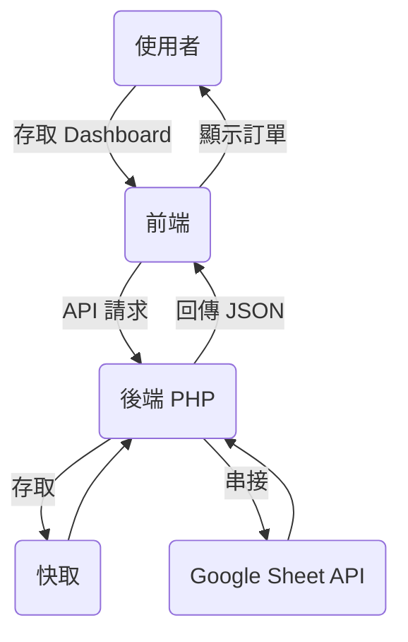
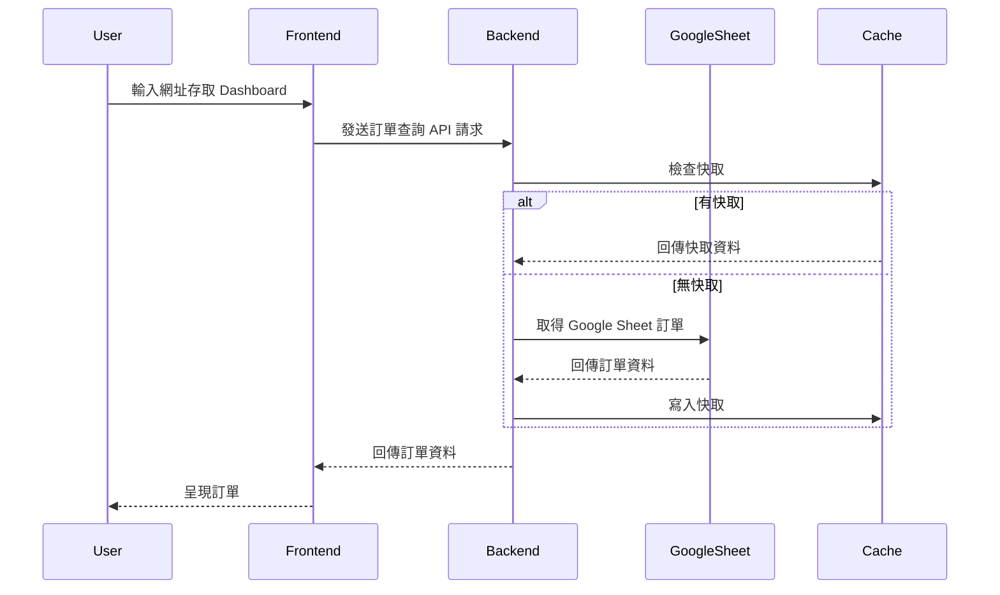
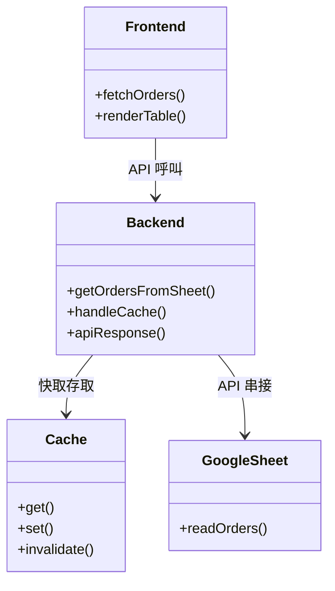
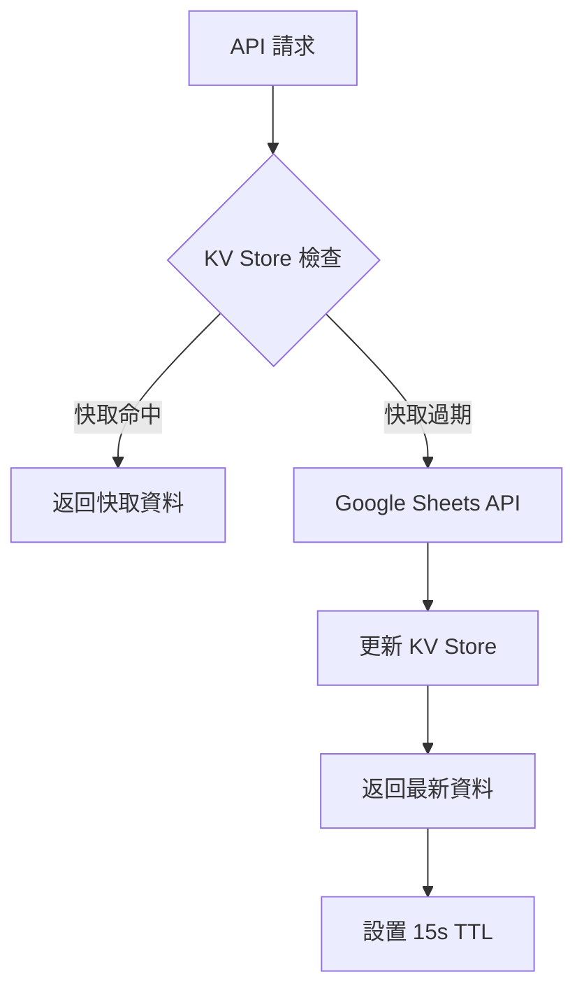

# 蘿蔔糕訂購系統後台管理 Dashboard - 專案規格文件

## 一、專案概述

### 1.1 專案簡介
蘿蔔糕訂購系統後台管理 Dashboard 是一個專業的訂單管理系統，主要功能為從 Google Sheets 取得訂單資料，並透過現代化的網頁 Dashboard 進行訂單管理、客戶管理、統計分析等操作。系統採用前後端分離架構，前端使用 React + TypeScript + Tailwind CSS，後端使用 PHP 串接 Google Sheets API，並具備完整的快取機制與權限控管。

**核心特色**：
- 🔄 **即時同步**：與 Google Sheets 雙向即時同步，確保資料一致性
- 📊 **智能統計**：提供多維度訂單統計與業績分析
- 🎯 **批量操作**：支援批量狀態更新、批量刪除等高效操作
- 🔍 **進階篩選**：多條件篩選、日期範圍查詢、模糊搜尋
- 📱 **響應式設計**：完美適配桌面端與行動裝置
- 🛡️ **安全機制**：完整的權限控管與資料驗證
- ⚡ **效能優化**：多層快取機制，提升載入速度

### 1.2 專案目標
- 提供直觀易用的訂單管理介面
- 實現與 Google Sheets 的即時資料同步
- 支援批量操作提升管理效率
- 提供詳細的統計分析功能
- 確保系統安全性與資料完整性

### 1.3 目標使用者
- 蘿蔔糕店家管理員
- 訂單處理人員
- 客服人員

## 二、系統架構圖（UML）

### 1. 流程圖


### 2. 循序圖


### 3. 物件關聯圖


## 三、核心功能模組

### 3.1 訂單管理系統
#### 3.1.1 訂單列表管理
- **訂單顯示**：完整的訂單資訊展示，包含客戶資料、商品明細、配送資訊
- **多重篩選**：支援按訂單狀態、配送方式、付款狀態、日期範圍進行篩選
- **智能搜尋**：支援客戶姓名、電話號碼、訂單編號的模糊搜尋
- **分頁顯示**：支援大量訂單的分頁瀏覽，提升載入效能
- **即時更新**：與 Google Sheets 即時同步，確保資料最新性

#### 3.1.2 訂單詳細管理
- **訂單詳情檢視**：完整的訂單資訊查看，包含所有欄位資料
- **商品編輯功能**：支援修改商品數量、新增/刪除商品項目
- **金額自動計算**：商品變更時自動重新計算總金額
- **狀態管理**：支援訂單狀態與付款狀態的獨立更新
- **備註編輯**：支援訂單備註的新增與修改

#### 3.1.3 批量操作功能
- **批量選擇**：支援多選訂單進行批量操作
- **批量狀態更新**：同時更新多筆訂單的處理狀態
- **批量付款狀態更新**：同時更新多筆訂單的付款狀態
- **批量刪除**：支援批量刪除訂單（含確認機制）
- **操作確認**：所有批量操作均有確認對話框防止誤操作

### 3.2 客戶管理系統
#### 3.2.1 客戶資料管理
- **客戶列表**：完整的客戶資料展示與管理
- **客戶搜尋**：支援姓名、電話、地址等多欄位搜尋
- **購買歷史**：查看客戶的完整購買記錄
- **客戶統計**：客戶購買次數、金額等統計資訊

#### 3.2.2 客戶分析功能
- **地區分析**：客戶地區分布統計
- **購買頻次分析**：客戶購買次數分組統計
- **忠誠度分析**：識別高價值客戶

### 3.3 統計分析系統
#### 3.3.1 訂單統計
- **即時統計**：總訂單數、各狀態訂單數量統計
- **金額統計**：總營業額、平均訂單金額統計
- **商品統計**：各商品銷售數量統計
- **時間趨勢**：訂單時間分布分析

#### 3.3.2 業績分析
- **日期範圍分析**：支援自定義日期範圍的業績分析
- **商品銷售排行**：熱銷商品排行榜
- **配送方式分析**：不同配送方式的使用統計
- **付款方式分析**：不同付款方式的使用統計

### 3.4 系統管理功能
#### 3.4.1 權限管理
- **管理員登入**：安全的管理員認證機制
- **Session 管理**：自動登出與會話保護
- **權限驗證**：API 存取權限控制

#### 3.4.2 資料管理
- **快取管理**：智能快取機制，提升系統效能
- **資料同步**：與 Google Sheets 的即時雙向同步
- **資料備份**：重要操作的資料備份機制
- **錯誤處理**：完整的錯誤處理與日誌記錄

### 3.5 匯出功能
#### 3.5.1 資料匯出
- **Excel 匯出**：支援訂單資料匯出為 Excel 格式
- **CSV 匯出**：支援 CSV 格式匯出，相容各種系統
- **篩選匯出**：支援按篩選條件匯出特定資料
- **自定義欄位**：支援選擇匯出的欄位內容

## 四、技術架構與規格

### 4.1 前端技術架構
#### 4.1.1 核心技術棧
- **框架**：React 18.3.1 (函數組件 + Hooks)
- **語言**：TypeScript 5.5.3 (嚴格類型檢查)
- **樣式**：Tailwind CSS 3.4.11 + shadcn/ui 組件庫
- **狀態管理**：React Query (TanStack Query) 5.56.2
- **路由**：React Router DOM 6.26.2
- **建置工具**：Vite 5.4.1 (快速開發與建置)

#### 4.1.2 UI 組件架構
- **設計系統**：基於 Radix UI 的 shadcn/ui 組件庫
- **圖標系統**：Lucide React 0.462.0
- **表單處理**：React Hook Form 7.53.0 + Zod 3.23.8 驗證
- **資料視覺化**：Recharts 2.12.7
- **通知系統**：Sonner 1.5.0 (Toast 通知)

#### 4.1.3 專案結構
```
src/
├── components/          # React 組件 (19個檔案)
│   ├── ui/             # 基礎 UI 組件 (shadcn/ui)
│   ├── Dashboard.tsx   # 主控台組件 - 統計卡片與概覽
│   ├── OrderList.tsx   # 訂單列表組件 (632行) - 核心訂單管理
│   ├── OrderDetail.tsx # 訂單詳情組件 - 單筆訂單檢視
│   ├── OrderItemEditor.tsx # 商品編輯器 - 訂單商品修改
│   ├── CustomerList.tsx # 客戶列表組件 - 客戶管理
│   ├── CustomerDetail.tsx # 客戶詳情組件 - 客戶資訊檢視
│   ├── OrderFilters.tsx # 訂單篩選器 - 多條件篩選
│   ├── CustomerFilters.tsx # 客戶篩選器
│   ├── BatchDeleteConfirmDialog.tsx # 批量刪除確認對話框
│   ├── DuplicateOrdersDialog.tsx # 重複訂單檢測對話框
│   ├── ModernSidebar.tsx # 現代化側邊欄導航
│   ├── CompactControlPanel.tsx # 緊湊控制面板
│   ├── StatusBadge.tsx # 訂單狀態徽章
│   ├── PaymentStatusBadge.tsx # 付款狀態徽章
│   ├── PaymentStatusEditor.tsx # 付款狀態編輯器
│   ├── StatCard.tsx # 統計卡片組件
│   └── ScrollToTopButton.tsx # 回到頂部按鈕
├── pages/              # 頁面組件 (4個檔案)
│   ├── Index.tsx       # 首頁 - 主要 Dashboard 頁面
│   ├── AdminLoginPage.tsx # 管理員登入頁
│   ├── AdminDashboardPage.tsx # 管理後台頁
│   └── NotFound.tsx    # 404 錯誤頁面
├── services/           # API 服務層 (2個檔案)
│   ├── orderService.ts # 訂單相關 API - 包含商品硬編碼邏輯
│   └── customerService.ts # 客戶相關 API
├── types/              # TypeScript 類型定義 (4個檔案)
│   ├── order.ts        # 訂單類型 - 包含商品統計類型
│   ├── customer.ts     # 客戶類型
│   ├── filters.ts      # 篩選器類型
│   └── global.d.ts     # 全域類型定義
├── hooks/              # 自定義 Hooks (2個檔案)
│   ├── use-mobile.tsx  # 行動裝置檢測
│   └── use-toast.ts    # Toast 通知
├── lib/                # 工具函數 (1個檔案)
│   └── utils.ts        # 通用工具函數
├── utils/              # 輔助工具 (4個檔案)
│   ├── exportUtils.ts  # 匯出功能 - Excel/CSV
│   ├── exportQuickStoreXlsx.ts # 快速商店格式匯出
│   ├── errorHandler.ts # 錯誤處理
│   └── uriErrorHandler.ts # URI 錯誤處理
└── routes/             # 路由配置 (1個檔案)
    └── adminRoutes.tsx # 管理員路由
```

### 4.2 後端技術架構
#### 4.2.1 核心技術
- **語言**：PHP 7.4+ (PSR-12 代碼規範)
- **API 架構**：RESTful API 設計
- **資料來源**：Google Sheets API v4
- **認證方式**：Google Service Account
- **依賴管理**：Composer

#### 4.2.2 API 端點設計
```
api/ (13個檔案)
├── common_headers.php           # 共用 CORS 標頭設置 (1KB)
├── get_orders_from_sheet.php    # 取得訂單列表 (4.6KB, 131行)
├── get_customers_from_sheet.php # 取得客戶列表 (5.6KB, 159行)
├── get_customer_orders.php      # 取得客戶訂單歷史 (7.1KB, 218行)
├── update_order_status.php      # 更新訂單狀態 (2.9KB, 91行)
├── update_payment_status.php    # 更新付款狀態 (2.1KB, 62行)
├── update_order_items.php       # 更新訂單商品 (4.3KB, 141行)
├── delete_order.php             # 刪除訂單 (6.6KB, 204行)
├── batch_delete_orders.php      # 批量刪除訂單 (7.5KB, 237行)
├── admin_login.php              # 管理員登入驗證 (1.1KB, 46行)
├── check_cache.php              # 快取檢查工具 (2.8KB, 89行)
├── check_api_path.php           # API 路徑檢查 (4.1KB, 118行)
└── test_api_access.php          # API 存取測試 (1.1KB, 36行)
```

**API 特色功能**：
- 🔄 **智能快取**：15秒快取機制，支援強制刷新
- 🛡️ **安全驗證**：時間戳 + 隨機數防重放攻擊
- 📊 **批量操作**：支援批量狀態更新與刪除
- 🔍 **錯誤追蹤**：完整的錯誤日誌與除錯工具
- 🌐 **CORS 支援**：跨域請求完整支援

#### 4.2.3 Google Sheets 整合
- **試算表 ID**：10MMALrfBonchPGjb-ps6Knw7MV6lllrrKRCTeafCIuo
- **工作表結構**：
  - Sheet1：主要訂單資料 (15個欄位)
  - 客戶名單：客戶基本資料 (8個欄位)
- **認證檔案**：service-account-key2.json
- **權限範圍**：SPREADSHEETS (讀寫權限)

### 4.3 快取機制
#### 4.3.1 伺服器端快取
- **快取目錄**：cache/ (自動建立，權限 755，目前包含36個快取檔案)
- **快取檔案類型**：
  - `orders_cache.json` (訂單快取)
  - `customers_cache.json` (客戶快取)
  - `customer_orders_{phone}_cache.json` (客戶訂單快取，按電話號碼分組)
- **快取時效**：15 秒 (可調整)
- **快取策略**：LRU (最近最少使用)
- **快取管理**：
  - 自動過期機制
  - 支援強制刷新 (`refresh=1` 參數)
  - 快取清理工具 (`clear-cache.bat`)
  - 快取狀態檢查 (`api/check_cache.php`)

#### 4.3.2 客戶端快取
- **記憶體快取**：orderService.ts 中的 orderCache
- **快取時效**：15 秒
- **快取清除**：資料更新後自動清除
- **強制刷新**：支援 refresh=1 參數繞過快取

### 4.4 安全性設計
#### 4.4.1 前端安全
- **XSS 防護**：React 內建 XSS 防護
- **CSRF 防護**：時間戳 + 隨機數驗證
- **輸入驗證**：Zod schema 驗證
- **敏感資料**：localStorage 加密存儲

#### 4.4.2 後端安全
- **CORS 設定**：嚴格的跨域請求控制
- **輸入過濾**：PHP 後端完整輸入驗證
- **SQL 注入防護**：參數化查詢 (雖然使用 Google Sheets)
- **認證機制**：Session + Token 雙重驗證

### 4.5 效能優化
#### 4.5.1 前端優化
- **代碼分割**：React.lazy + Suspense
- **組件優化**：React.memo + useMemo + useCallback
- **資源優化**：Vite 自動優化與壓縮
- **快取策略**：React Query 智能快取

#### 4.5.2 後端優化
- **API 優化**：批量操作減少請求次數
- **快取優化**：多層快取機制
- **資料庫優化**：Google Sheets 批量讀寫
- **壓縮傳輸**：Gzip 壓縮回應資料

## 五、Cloudflare Pages + Workers 部署架構

### 5.1 現代化架構設計
#### 5.1.1 前端：Cloudflare Pages
- **框架**：React + TypeScript + Vite
- **部署平台**：Cloudflare Pages (全球 CDN)
- **靜態資源**：自動優化與壓縮
- **CI/CD**：GitHub Actions 自動部署
- **域名管理**：Cloudflare DNS

#### 5.1.2 後端：Cloudflare Workers
- **運行環境**：Cloudflare Workers (V8 JavaScript)
- **API 框架**：Hono + chanfana (OpenAPI)
- **無伺服器**：邊緣運算，全球分佈
- **成本效益**：按請求計費，低成本高效能
- **開發語言**：TypeScript

#### 5.1.3 資料存取
- **資料來源**：Google Sheets API v4
- **認證方式**：Google Service Account
- **快取策略**：Workers KV Store (全球快取)
- **安全性**：Cloudflare WAF + DDoS 防護

### 5.2 傳統 PHP 架構 vs Cloudflare 架構對比

| 項目 | 傳統 PHP 架構 | Cloudflare 架構 |
|------|---------------|-----------------|
| **前端託管** | Apache/Nginx + PHP | Cloudflare Pages |
| **後端 API** | PHP 7.4+ | Cloudflare Workers |
| **快取機制** | 檔案系統快取 | Workers KV Store |
| **部署方式** | FTP/SSH 手動部署 | Git 自動部署 |
| **全球可用性** | 單一伺服器 | 全球邊緣網路 |
| **擴展性** | 垂直擴展 | 自動水平擴展 |
| **成本** | 固定伺服器費用 | 按使用量計費 |
| **維護成本** | 伺服器維護 | 無伺服器維護 |

### 5.3 Workers API 遷移架構

#### 5.3.1 API 端點對應表
| PHP 端點 | Workers 端點 | 狀態 | 複雜度 |
|----------|--------------|------|--------|
| `get_orders_from_sheet.php` | `endpoints/getOrdersFromSheet.ts` | ❌ 待遷移 | ⭐⭐⭐ |
| `get_customers_from_sheet.php` | `endpoints/getCustomersFromSheet.ts` | ❌ 待遷移 | ⭐⭐⭐ |
| `update_order_status.php` | `endpoints/updateOrderStatus.ts` | ❌ 待遷移 | ⭐⭐⭐⭐ |
| `update_payment_status.php` | `endpoints/updatePaymentStatus.ts` | ❌ 待遷移 | ⭐⭐⭐ |
| `update_order_items.php` | `endpoints/updateOrderItems.ts` | ❌ 待遷移 | ⭐⭐⭐⭐ |
| `delete_order.php` | `endpoints/deleteOrder.ts` | ❌ 待遷移 | ⭐⭐⭐⭐⭐ |
| `batch_delete_orders.php` | `endpoints/batchDeleteOrders.ts` | ❌ 待遷移 | ⭐⭐⭐⭐⭐ |
| `admin_login.php` | `endpoints/adminLogin.ts` | ❌ 待遷移 | ⭐⭐⭐ |
| `get_customer_orders.php` | `endpoints/getCustomerOrders.ts` | ❌ 待遷移 | ⭐⭐ |

#### 5.3.2 Workers 技術棧
```typescript
// 核心框架
import { Hono } from 'hono';
import { fromHono } from 'chanfana';

// Google Sheets 整合
import { GoogleAuth } from 'google-auth-library';
import { sheets_v4 } from 'googleapis';

// 快取與存儲
interface Env {
  ORDERS_CACHE: KVNamespace;
  GOOGLE_SERVICE_ACCOUNT: string; // Secret
  SHEETS_ID: string;
}
```

#### 5.3.3 快取策略設計


#### 5.3.4 核心功能實作重點

**A. Google Sheets 整合**
```typescript
class SheetsService {
  private auth: GoogleAuth;
  private sheets: sheets_v4.Sheets;
  
  constructor(serviceAccountKey: string) {
    this.auth = new GoogleAuth({
      credentials: JSON.parse(serviceAccountKey),
      scopes: ['https://www.googleapis.com/auth/spreadsheets']
    });
  }
  
  async getOrders(): Promise<Order[]> {
    // 實作細節...
  }
  
  async updateOrderStatus(id: string, status: string): Promise<void> {
    // 實作細節...
  }
}
```

**B. KV Store 快取管理**
```typescript
class CacheManager {
  constructor(private kv: KVNamespace) {}
  
  async get<T>(key: string): Promise<T | null> {
    const cached = await this.kv.get(key, 'json');
    return cached as T;
  }
  
  async set<T>(key: string, value: T, ttl: number = 15): Promise<void> {
    await this.kv.put(key, JSON.stringify(value), {
      expirationTtl: ttl
    });
  }
  
  async invalidate(pattern: string): Promise<void> {
    // 清除相關快取
  }
}
```

**C. 錯誤處理與重試**
```typescript
class ApiError extends Error {
  constructor(
    public status: number,
    message: string,
    public code?: string
  ) {
    super(message);
  }
}

const withRetry = async <T>(
  fn: () => Promise<T>,
  maxRetries = 3
): Promise<T> => {
  // 指數退避重試邏輯
};
```


#### 5.2.1 建置流程
```bash
# 安裝依賴
npm install

# 生產環境建置
npm run build

# 開發環境建置 (含 source map)
npm run build:dev
```

#### 5.2.2 部署設定
- **建置輸出**：dist/ 目錄
- **靜態資源**：自動優化與壓縮
- **路由設定**：需要 .htaccess 支援 SPA 路由
- **環境變數**：API_BASE 路徑設定

### 5.3 後端部署
#### 5.3.1 檔案部署
- **API 檔案**：api/ 目錄上傳至伺服器
- **憑證檔案**：service-account-key2.json (權限 600)
- **快取目錄**：cache/ 目錄 (權限 755，可寫入)
- **依賴安裝**：composer install --no-dev

#### 5.3.2 權限設定
```bash
# 設定檔案權限
chmod 644 api/*.php
chmod 600 service-account-key2.json
chmod 755 cache/
chmod 666 cache/*.json
```

### 5.4 前端部署 (Cloudflare Pages)
#### 5.4.1 快取規則
- **API 路徑**：*yourdomain.com/api/* (繞過快取)
- **靜態資源**：*yourdomain.com/assets/* (長期快取)
- **HTML 檔案**：*yourdomain.com/*.html (短期快取)

#### 5.4.2 安全設定
- **SSL/TLS**：完整 (嚴格) 模式
- **HSTS**：啟用 (max-age=31536000)
- **防火牆規則**：阻擋惡意請求

### 5.5 監控與維護
#### 5.5.1 日誌監控
- **錯誤日誌**：PHP error_log 監控
- **存取日誌**：Apache/Nginx access_log 分析
- **效能監控**：API 回應時間追蹤

#### 5.5.2 備份策略
- **程式碼備份**：Git 版本控制
- **資料備份**：Google Sheets 自動備份
- **設定備份**：定期備份設定檔案

## 六、資料結構定義

### 6.1 訂單資料結構 (Order)
```typescript
interface Order {
  id: string;                    // 訂單 ID (行索引)
  orderNumber: string;           // 訂單編號 (ORD-xxx)
  customer: {                    // 客戶資訊
    name: string;                // 客戶姓名
    phone: string;               // 聯絡電話
  };
  items: OrderItem[];            // 訂單商品列表
  total: number;                 // 訂單總金額
  status: OrderStatus;           // 訂單狀態
  createdAt: string;             // 建立時間
  deliveryMethod: string;        // 配送方式
  deliveryAddress: string;       // 配送地址
  dueDate: string;              // 希望到貨日期
  deliveryTime: string;         // 配送時段
  paymentMethod: string;        // 付款方式
  notes: string;                // 備註
  paymentStatus?: PaymentStatus; // 付款狀態
}
```

### 6.2 商品項目結構 (OrderItem)
```typescript
interface OrderItem {
  product: string;    // 商品名稱
  price: number;      // 單價
  quantity: number;   // 數量
  subtotal: number;   // 小計
}
```

### 6.3 客戶資料結構 (Customer)
```typescript
interface Customer {
  name: string;           // 客戶姓名
  phone: string;          // 聯絡電話
  address: string;        // 地址
  deliveryMethod: string; // 偏好配送方式
  totalOrders: number;    // 總訂單數
  totalAmount: number;    // 總消費金額
  lastOrderDate: string;  // 最後訂購日期
  region: string;         // 地區
}
```

### 6.4 Google Sheets 欄位對應
#### 6.4.1 訂單工作表 (Sheet1)
| 欄位 | 說明 | 資料類型 | 範例 |
|------|------|----------|------|
| A | 時間戳記 | DateTime | 2024-12-20 14:30:25 |
| B | 客戶姓名 | String | 王小明 |
| C | 聯絡電話 | String | '0912345678 |
| D | 配送方式 | String | 宅配到府 |
| E | 配送地址 | String | 台北市信義區信義路五段7號 |
| F | 希望到貨日期 | Date | 2024-12-21 |
| G | 希望到貨時間 | String | 上午 (13點前) |
| H | 備註 | String | 請按門鈴 |
| I | 訂單項目 | String | 原味蘿蔔糕 x 2, 芋頭糕 x 1 |
| J | 總金額 | Number | 850 |
| K | 聯絡方式 | String | LINE |
| L | 社群帳號 | String | 'line123456 |
| M | 付款方式 | String | 銀行轉帳 |
| N | 行號 | Number | 1 |
| O | 訂單狀態 | String | 訂單確認中 |
| P | 付款狀態 | String | 未收費 |

## 七、業務規則與邏輯

### 7.1 訂單狀態管理
- **訂單確認中**：新建訂單的初始狀態
- **已抄單**：訂單已確認並開始處理
- **已出貨**：商品已發送給客戶
- **取消訂單**：訂單已取消

### 7.2 付款狀態管理
- **未收費**：尚未收到款項
- **已收費**：已收到全額款項
- **待轉帳**：等待客戶轉帳
- **未全款**：僅收到部分款項
- **特殊**：特殊付款情況

### 7.3 商品定價規則
- **原味蘿蔔糕**：NT$250/條
- **芋頭粿**：NT$350/條
- **台式鹹蘿蔔糕**：NT$350/條
- **鳳梨豆腐乳**：NT$300/瓶

**⚠️ 重要規劃事項**：目前商品資訊（名稱、價格）採用硬編碼方式實作，分散在多個檔案中：
- `src/components/OrderItemEditor.tsx` (第25-28行)
- `src/services/orderService.ts` (第149-152行、第362-368行)
- `src/components/Dashboard.tsx` (第111-123行)
- `src/types/order.ts` (第38-41行)

**後期優化計畫**：規劃將商品硬編碼改為動態載入，以便後期新增新商品，建議實作方向：
1. 建立商品管理 API 端點 (`api/products_manager.php`)
2. 新增商品資料表或 Google Sheets 工作表
3. 實作商品 CRUD 功能
4. 重構前端組件使用動態商品資料
5. 建立商品管理後台介面

### 7.4 配送方式
- **宅配到府**：需完整地址資訊
- **7-11門市**：需門市代碼與地址
- **門市取貨**：直接到店取貨

## 八、API 介面規格

### 8.1 請求格式規範
#### 8.1.1 GET 請求
- 添加時間戳防止快取：`?_={timestamp}`
- 添加隨機數確保唯一性：`&nonce={random}`
- 強制刷新參數：`&refresh=1`

#### 8.1.2 POST 請求
```json
{
  "id": "訂單ID",
  "status": "新狀態",
  "timestamp": 1640000000,
  "nonce": "random_string"
}
```

### 8.2 回應格式規範
#### 8.2.1 成功回應
```json
{
  "success": true,
  "data": [...],
  "timestamp": 1640000000,
  "request_id": "unique_id"
}
```

#### 8.2.2 錯誤回應
```json
{
  "success": false,
  "message": "錯誤訊息",
  "timestamp": 1640000000,
  "request_id": "unique_id"
}
```

## 九、開發規範與流程

### 9.1 前端開發規範
- **組件命名**：PascalCase (OrderList.tsx)
- **函數命名**：camelCase (fetchOrders)
- **常數命名**：UPPER_SNAKE_CASE (API_BASE)
- **類型定義**：interface 優於 type
- **狀態管理**：React Hooks + React Query

### 9.2 後端開發規範
- **代碼風格**：PSR-12 標準
- **檔案命名**：snake_case (get_orders_from_sheet.php)
- **錯誤處理**：統一的 try-catch 機制
- **安全性**：輸入驗證 + CORS 設定

### 9.3 版本控制
- **分支策略**：Git Flow (main/develop/feature/hotfix)
- **提交規範**：Conventional Commits
- **代碼審查**：Pull Request 必須審查

## 十、測試策略

### 10.1 前端測試
- **單元測試**：Jest + React Testing Library
- **組件測試**：Storybook
- **E2E 測試**：Playwright

### 10.2 後端測試
- **API 測試**：Postman/Insomnia
- **整合測試**：PHPUnit
- **效能測試**：Apache Bench

## 十一、專案檔案統計

### 11.1 專案規模
- **總檔案數**：約 70+ 個檔案
- **程式碼檔案**：
  - TypeScript/React：約 30 個檔案
  - PHP API：13 個檔案
  - 配置檔案：10+ 個檔案
- **文件檔案**：25+ 個 Markdown 文件
- **快取檔案**：36 個 JSON 快取檔案

### 11.2 核心檔案清單

#### 前端核心檔案
- `src/components/OrderList.tsx` (632行) - 訂單列表核心組件
- `src/components/OrderItemEditor.tsx` - 商品編輯器 **[包含硬編碼商品]**
- `src/services/orderService.ts` - 訂單服務 **[包含硬編碼商品邏輯]**
- `src/components/Dashboard.tsx` - 主控台 **[包含硬編碼商品統計]**
- `src/types/order.ts` - 訂單類型定義 **[包含硬編碼商品類型]**

#### 後端核心檔案
- `api/get_orders_from_sheet.php` (131行) - 訂單資料取得
- `api/batch_delete_orders.php` (237行) - 批量刪除功能
- `api/update_order_items.php` (141行) - 商品更新功能
- `sheets_api_handler.php` (452行) - Google Sheets API 處理器
- `service-account-key2.json` - Google API 認證金鑰

#### 配置與建置檔案
- `package.json` - 前端依賴管理 (90行)
- `vite.config.ts` - Vite 建置配置 (93行)
- `tailwind.config.ts` - Tailwind CSS 配置 (107行)
- `.htaccess` - Apache 伺服器配置

### 11.3 重要商品硬編碼位置
**需要重構的檔案**（商品動態化時需修改）：
1. `src/components/OrderItemEditor.tsx` (第25-28行)
2. `src/services/orderService.ts` (第149-152行、第362-368行)
3. `src/components/Dashboard.tsx` (第111-123行)
4. `src/types/order.ts` (第38-41行)

## 十二、參考文件
- [開發指南](DEVELOPMENT_GUIDE.md)
- [API 文件](API_DOCUMENTATION.md)
- [專案規則](PROJECT_RULES.md)
- [測試指南](TESTING_GUIDE.md)
- [部署指南](CLOUDFLARE_GUIDE.md)
- [商品編輯器指南](ORDER_ITEM_EDITOR_GUIDE.md)
- [批量刪除功能](BATCH_DELETE_FEATURE.md)
- [重複訂單檢測](DUPLICATE_ORDERS_FEATURE.md)
- [UI/UX 優化指南](UI_UX_OPTIMIZATION_GUIDE.md)

---
**文件版本**：v2.1  
**最後更新**：2025-01-28  
**維護者**：開發團隊  
**分析日期**：2025-01-28  

本文件為專案開發規格依據，後續如有異動請同步更新。所有功能開發與系統架構設計均應遵循本規格文件的規範與標準。

**⚠️ 重要提醒**：本專案目前採用商品硬編碼方式，建議後期重構為動態商品管理系統，以提升系統彈性與可維護性。
